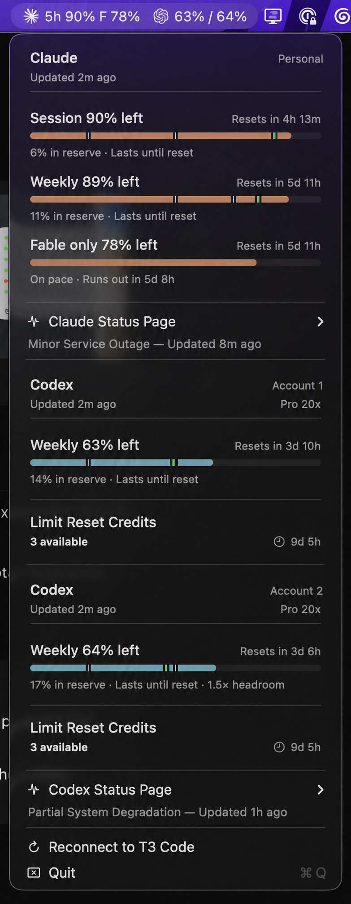

# T3QuotaBar

An unofficial macOS menu-bar client for T3 Code usage limits.

Native macOS app. Requires macOS 14 or newer and a running local T3 Code desktop installation.

T3QuotaBar displays the quota information T3 Code already collects, including native provider accounts and accounts behind CLIProxyAPI. It reads T3's existing snapshots instead of polling provider quota endpoints itself.



Account labels in this screenshot have been anonymized.

## Interface

- One menu-bar item with Claude and Codex readouts side by side.
- Claude session and Fable-specific percentages remaining, with the general weekly limit in the dropdown.
- Weekly percentages for every Codex account.
- A dropdown with per-account cards, reset countdowns, data age, and available reset credits.
- Even-pace reserve estimates when T3 supplies the window duration.
- Provider status and links to the official status pages.

The interface uses copied [CodexBar](https://github.com/steipete/CodexBar) card views, progress bars, menu hosting, layout and icons. Its MIT license is bundled in the app. [Source provenance](PROVENANCE.md) lists the exact upstream revision and adaptations for T3.

## Download

Every push to `main` builds an Apple Silicon app. Open the latest successful [Build macOS app run](https://github.com/aprets/t3quotabar/actions/workflows/build.yml), then download `T3QuotaBar-macOS-arm64.zip` under **Artifacts**. GitHub requires signing in to download artifacts, which are kept for 30 days.

Unzip it and move `T3QuotaBar.app` to Applications. These builds are ad-hoc signed, not notarized. If macOS blocks opening it, use **System Settings → Privacy & Security → Open Anyway** after attempting to launch. Updates may require connecting to T3 Code again because CI builds do not share a stable signing identity.

## Build and run

```sh
bash scripts/test.sh
bash scripts/build-app.sh
open dist/T3QuotaBar.app
```

Copy `dist/T3QuotaBar.app` to Applications to install. Click the menu-bar item, then **Connect to T3 Code**. The app invokes T3's bundled `pair` CLI and saves a read-only bearer session in macOS Keychain. It supports T3 Code and T3 Code Alpha installed in `/Applications`, using the default `~/.t3` data directory.

To check the connection without printing account emails or credentials:

```sh
dist/T3QuotaBar.app/Contents/MacOS/T3QuotaBar --diagnose
dist/T3QuotaBar.app/Contents/MacOS/T3QuotaBar --check-reconnect
```

Add `--pair` for the first diagnostic connection. The app has no standalone window; both account cards and actions live in native menu-bar menus.

Builds are not notarized. No automatic updater or launch-at-login setting is included.
Use a stable signing certificate to retain Keychain access across rebuilds. Set `CODE_SIGN_IDENTITY` or put its fingerprint in the gitignored `.signing-identity` file. Without one, the build falls back to ad-hoc signing and requires pairing again after code changes. Background Keychain reads never display authorization dialogs. A blocked read stops reconnect attempts and asks you to connect explicitly.

## Data source

The integration pairs with an existing T3 Code server and subscribes to its authenticated WebSocket API. T3 Code must be running for fresh quota data. Its API is internal and may change between releases. The app requests `orchestration:read`, T3's narrowest applicable scope, which also permits other environment reads. The app only subscribes to configuration and quota snapshots.

No CLIProxyAPI management key or provider login is needed by this app. Provider status is fetched separately from public status endpoints every five minutes.

Failed probes and disconnected sessions keep last-good data in memory. A dot in the menu bar and a warning in the dropdown mark stale values. Snapshots older than 20 minutes are also marked stale. Last-good data is not persisted across app restarts. Expired authorization requires clicking Connect again. Each T3 server still has its own cache; this app does not coordinate refreshes across machines.

T3's default background policy can pause CPA polling when its window is unfocused. Keeping the T3 process running does not guarantee fresh snapshots. T3's Performance background profile can allow background polling; T3QuotaBar does not change that setting or submit activity leases. T3 also probes native providers when a client subscribes. This app makes no explicit quota-refresh calls, but connecting is therefore not entirely free of upstream traffic. Reconnects back off from one to five minutes; authorization and decoding failures stop until manual reconnection.

Native and CPA entries with the same provider and email are shown once, preferring CPA. Missing Fable stays unavailable. Reset credits show the count and next expiry only, because T3 does not provide every expiry. No credit redemption is performed.

See [implementation notes](IMPLEMENTATION.md) for the inspected protocol, limitations, and first-build checks.

T3QuotaBar is an independent project and is not affiliated with T3 Code, OpenAI, or Anthropic.

## License

[MIT](LICENSE). Copied CodexBar code and assets retain their [original MIT notice](Sources/T3QuotaBar/Resources/CodexBar-LICENSE).
